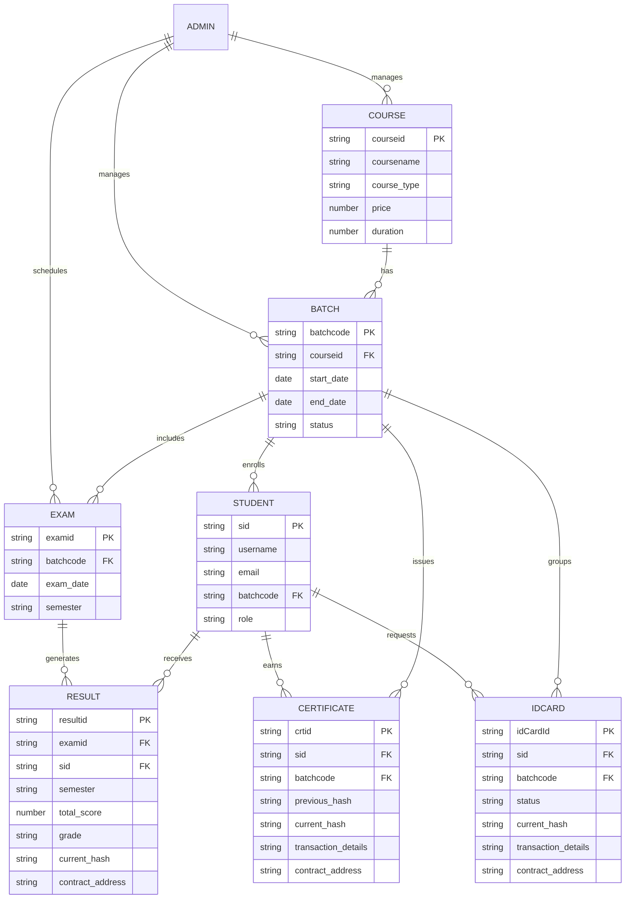
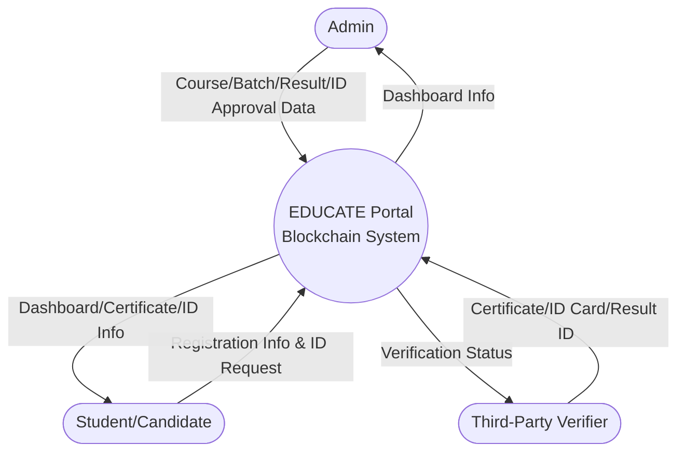
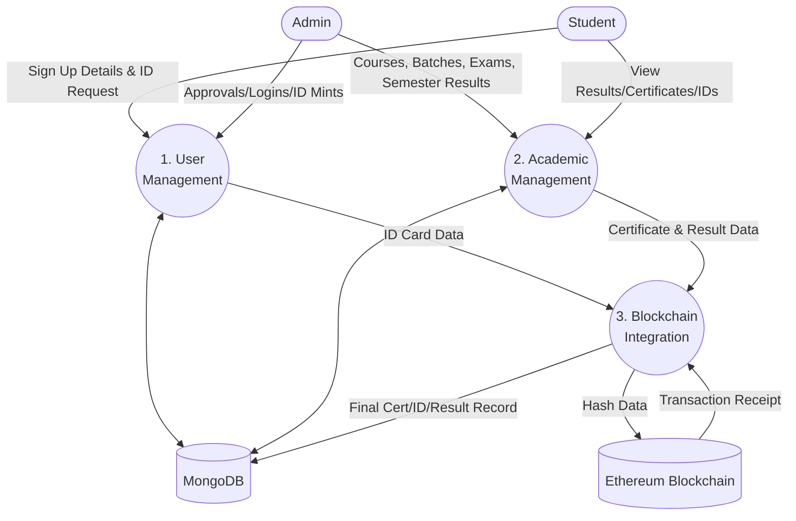
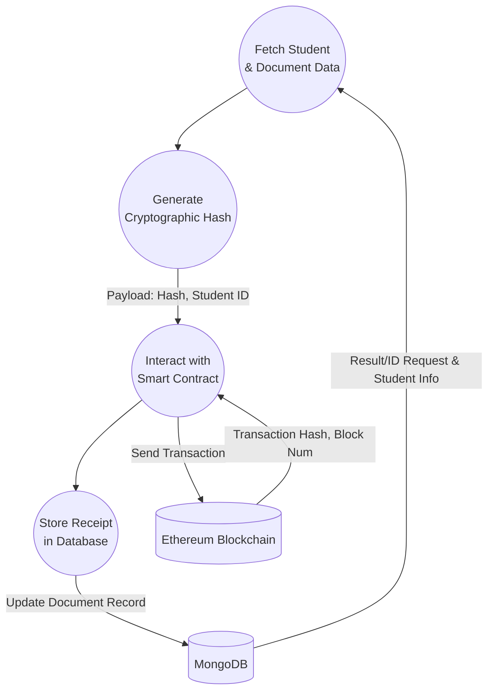

# EDUCATE Portal - Project Documentation

## 1. Problem Statement
Traditional educational certificates and identity cards are highly susceptible to forgery, tampering, and physical damage. Verifying the authenticity of paper-based or even conventional digital documents involves tedious, manual processes that are time-consuming and inefficient for employers and institutions. There is a critical need for a decentralized, secure, and instantly verifiable system for academic credentials and student identity to ensure trust and transparency.

## 2. Features
- **Admin Dashboard**: Comprehensive management tools for creating courses, managing batches, enrolling students, scheduling exams, processing results, issuing certificates, and approving/minting digital ID cards.
- **Candidate Dashboard**: A personalized portal for students to view enrolled courses, track upcoming exams, check semester results, request blockchain-backed ID cards, and access their verified certificates.
- **Dynamic Result & Grade Management**: Detailed management of marks and subjects dynamically based on the course type:
  - **Certificate Courses**: Direct evaluation with 2 core subjects.
  - **Diploma/Graduation Courses**: Semester-based evaluation featuring 5 subjects per semester. The final consolidated certificate is only generated after all semesters are successfully completed.
- **Blockchain-based Document Verification**: Generates a cryptographic hash of certificate, ID card, and individual semester result details, securely storing them on the Ethereum blockchain. This ensures absolute immutability and verifiable authenticity.
- **Decentralized Trust**: Secures academic credentials, semester results, and student identity on an immutable ledger, preventing unauthorized modifications.

## 3. Project Proposal with Feasibility Study
**Proposal**: To develop a decentralized education portal leveraging the MERN stack for robust data management and Web3 blockchain technology (Ethereum) to issue, store, and verify immutable academic certificates, ID cards, and semester-by-semester results.

**Feasibility Study**:
- **Technical Feasibility**: High. The MERN stack (MongoDB, Express, React, Node) is a proven architecture for scalable web applications. Ethereum and Hardhat provide an established ecosystem for smart contract development.
- **Operational Feasibility**: High. The user interface is designed to abstract blockchain complexities, making it user-friendly for non-technical administrators and students to request and mint Web3 documents.
- **Economic Feasibility**: The project utilizes local testnets (Hardhat) during development to ensure zero gas costs. For production, optimized smart contracts will minimize transaction fees (gas), making it a cost-effective solution for institutions.

## 4. System Analysis
The system operates around three primary domains: Administration, Student Portal, and the Blockchain Network.
- **Admin Domain**: Manages the core educational workflows—from course creation to ID card approvals, semester result uploads, and final certificate issuance.
- **Candidate Domain**: Allows students to access their educational records, request Web3 ID cards, view individual semester results, and access cryptographic certificates upon course completion.
- **Blockchain Domain**: Acts as the immutable ledger. When an ID card, semester result, or final certificate is generated, its unique hash and transaction details are permanently recorded on the blockchain.

## 5. Architecture Used
The system utilizes a hybrid Client-Server and Decentralized Web3 Architecture:
- **Frontend (Client)**: React.js, Vite, and Bootstrap for a responsive, dynamic User Interface.
- **Backend (Server)**: Node.js and Express.js providing RESTful APIs.
- **Database**: MongoDB with Mongoose ODM for structured data storage (Courses, Students, Exams, Results, ID Cards, etc.).
- **Blockchain**: Ethereum Network, Solidity Smart Contracts, Hardhat (local Ethereum node), and Ethers.js/Web3.js for seamless backend-to-blockchain communication.

## 6. Project Flow Using SDLC (Software Development Life Cycle)
1. **Requirement Analysis**: Identifying the vulnerability of traditional credentials and defining the need for a blockchain-based verification system.
2. **Design**: Architecting the database schemas (MongoDB), smart contract logic (Solidity), and UI/UX wireframes (React) to handle varying course types.
3. **Implementation/Coding**: Developing the REST APIs, building frontend components, and writing/deploying smart contracts.
4. **Testing**: Unit testing individual components, smart contract testing on the Hardhat node, and end-to-end integration testing.
5. **Deployment**: Deploying the frontend (e.g., Vercel), backend (e.g., AWS/Render), database (MongoDB Atlas), and smart contracts to an Ethereum testnet/mainnet.
6. **Maintenance**: Monitoring system health, managing database backups, and updating UI components based on user feedback.

## 7. Project Flow with Process
1. **Setup**: Admin creates a new `Course` (specifying if it is a Certificate or Diploma/Degree) and initializes a `Batch`.
2. **Onboarding**: Candidates sign up on the portal. Admin approves and assigns them to the active `Batch`.
3. **ID Card Request & Issuance**: 
   - Candidate requests an ID card from their dashboard.
   - Admin reviews pending ID card requests, approves, and mints the ID card to the Ethereum blockchain.
4. **Examination**: Admin schedules an `Exam` for the specific batch and semester.
5. **Evaluation & Result Minting**: 
   - Admin uploads the `Results` (marks, subjects, grades) for the candidates. 
   - **For Certificate courses:** 2 subjects are evaluated.
   - **For Diploma/Graduation courses:** 5 subjects are evaluated per semester.
   - *Crucially, each semester's result data is immediately anchored to the Ethereum Blockchain as an immutable record.*
6. **Final Certificate Issuance**: 
   - For Certificate courses, the certificate is generated immediately after the single exam result.
   - For Diploma/Graduation courses, the system ensures all requisite semesters are completed before the Admin can generate the final consolidated `Certificate`.
7. **Certificate Blockchain Anchoring**: The system calculates a cryptographic hash of the final certificate data and initiates a transaction to store it on the Ethereum Blockchain.
8. **Verification**: Any third party can verify the authenticity of a Certificate, ID Card, or a specific Semester Result in real-time by querying the blockchain using the unique ID or scanning the generated QR code.

## 8. Entity-Relationship Diagram (ERD)



## 9. Data Flow Diagrams (DFD)

### Level 0 DFD (Context Diagram)


### Level 1 DFD (Main Processes)


### Level 2 DFD (Document Generation Process)


## 10. Testing
- **Unit Testing**: Isolating and testing individual React components (e.g., Dashboard metrics) and backend controllers (e.g., User authentication logic).
- **Smart Contract Testing**: Utilizing Hardhat and Chai to rigorously test the immutability, event emission, and retrieval functions of the Solidity contracts before deployment (including Certificate, IdCard, and Result minting functions).
- **Integration Testing**: Ensuring the Node.js backend correctly synchronizes data writes between MongoDB and the Ethereum node without race conditions.
- **Security Testing**: Auditing for common Web3 vulnerabilities (e.g., Reentrancy, Overflow) and traditional web vulnerabilities (e.g., XSS in React, NoSQL injection in MongoDB).

## 11. Deployment
- **Frontend Architecture**: Deployed as a static bundle using services like Vercel, Netlify, or AWS S3 & CloudFront for fast global delivery.
- **Backend Architecture**: Hosted on scalable platforms like AWS EC2, Heroku, or Render to handle API requests and blockchain interactions.
- **Database Layer**: Managed MongoDB Atlas cluster for a highly available, scalable NoSQL database.
- **Blockchain Layer**: Smart contracts are deployed to an Ethereum testnet (e.g., Sepolia) or Mainnet. The backend communicates with the network via RPC providers like Infura or Alchemy.

## 12. Security
- **Data Integrity (Blockchain)**: The primary security feature. Once a document's hash is anchored to the Ethereum blockchain, it is mathematically impossible to alter without invalidating the hash, guaranteeing authenticity.
- **Authentication & Authorization**: Role-based access control (Admin vs. Candidate) implemented using secure JWT (JSON Web Tokens) or session management.
- **Data Privacy**: Sensitive personal details (PII) are stored securely in MongoDB. Only the non-reversible cryptographic hash and public identifiers are exposed on the public blockchain, ensuring GDPR compliance.
- **Input Validation**: Strict Mongoose schemas and backend validation middleware enforce data types and constraints to prevent NoSQL injection and malformed data entry.


## Prerequisites
Before installing the dependencies, ensure you have the following installed on your system:
- Node.js (v16.x or higher recommended)
- npm (Node Package Manager)

### Step 1: Backend Dependencies
Navigate to the backend directory and install the necessary packages:
```bash
cd backend
npm install
```

**Dependencies:**
- `cors`: Middleware to enable Cross-Origin Resource Sharing.
- `ethers`: Library for interacting with the Ethereum Blockchain.
- `express`: Fast, unopinionated, minimalist web framework for Node.js.
- `mongoose`: MongoDB object modeling tool.
- `multer`: Node.js middleware for handling file uploads.

### Step 2: Frontend Dependencies
Navigate to the frontend directory and install the necessary packages:
```bash
cd frontend
npm install
```

**Dependencies:**
- `bootstrap`: CSS framework for responsive design.
- `ethers`: Library for interacting with the Ethereum Blockchain.
- `html2canvas`: Takes "screenshots" of webpages to build the certificate visually.
- `jspdf`: Library to generate PDFs (used for downloading documents).
- `qrcode.react`: React component to generate QR codes for verification.
- `react` & `react-dom`: Core React libraries for building the UI.
- `react-router-dom`: Declarative routing for React web applications.

**Dev Dependencies:**
Tools and plugins related to Vite, ESLint, and TypeScript declarations (`@eslint/js`, `@vitejs/plugin-react`, `vite`, etc.) for development.

### Step 3: Ethereum (Blockchain) Dependencies
Navigate to the ethereum directory and install the necessary packages:
```bash
cd ethereum
npm install
```

**Dev Dependencies:**
- `@nomicfoundation/hardhat-toolbox`: Bundles all the commonly used Hardhat plugins.
- `hardhat`: Ethereum development environment for compiling, testing, and deploying smart contracts locally.

**Dependencies:**
Various low-level tools required by the Ethereum ecosystem (`adm-zip`, `ethereum-cryptography`, `micro-eth-signer`, `tsx`, `zod`, etc.).

---

## Instructions

> **Note:** Your development servers are currently running for all three modules (`npx hardhat node`, `npm start` for backend, and `npm run dev` for frontend).

### 1. Ethereum Directory
Go to the Ethereum directory to start the local blockchain node (Ganache/Hardhat):
```powershell
cd .\ethereum\
npx hardhat node
```
Open another terminal for the Ethereum directory to deploy the smart contract to the local network:
```powershell
cd .\ethereum\
npx hardhat run scripts/deployCertificate.js --network localhost
```

### 2. Backend Directory
Start the backend server:
```powershell
cd .\backend\
npm start
```

### 3. Frontend Directory
Start the frontend development server:
```powershell
cd .\frontend\
npm run dev
```
The frontend should be accessible at `http://localhost:5173/`.

### Repository Link
[https://github.com/saikatssg/student-education-portal/tree/main](https://github.com/saikatssg/student-education-portal/tree/main)
