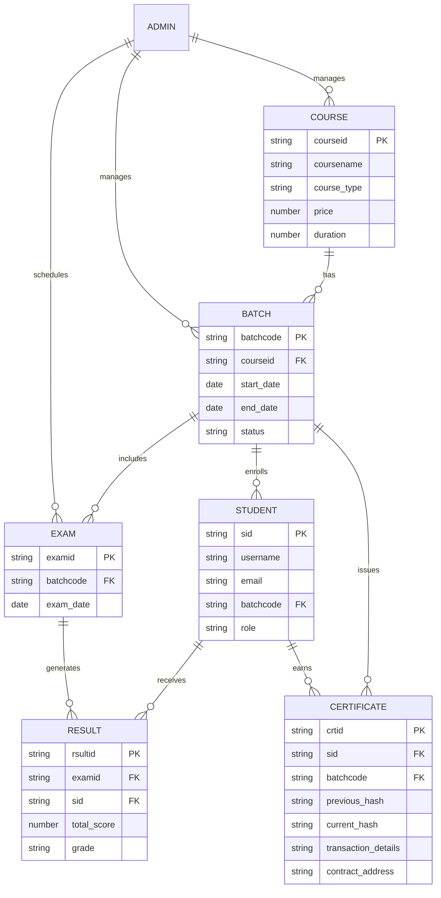
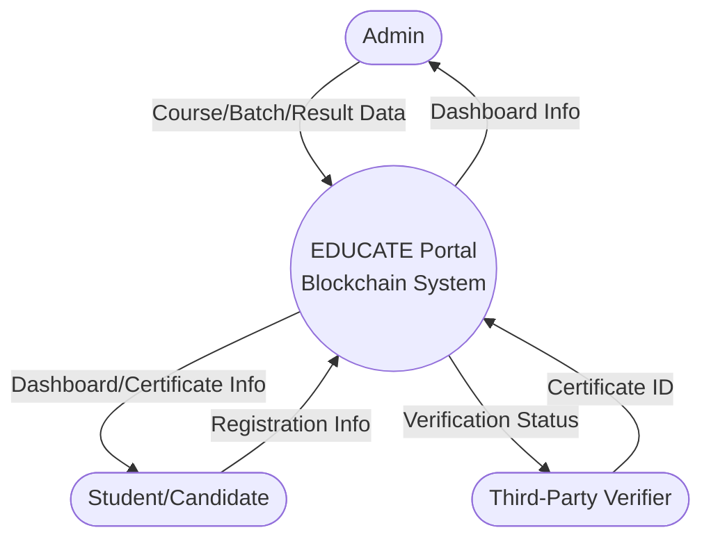
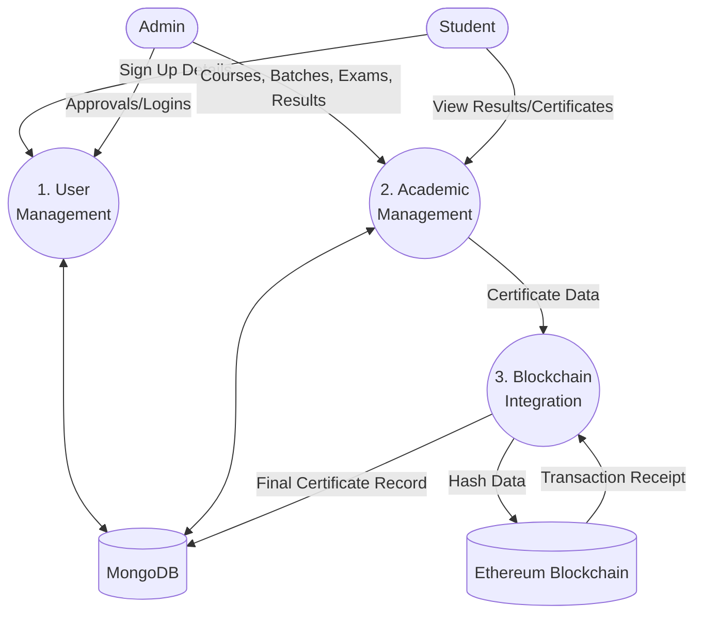
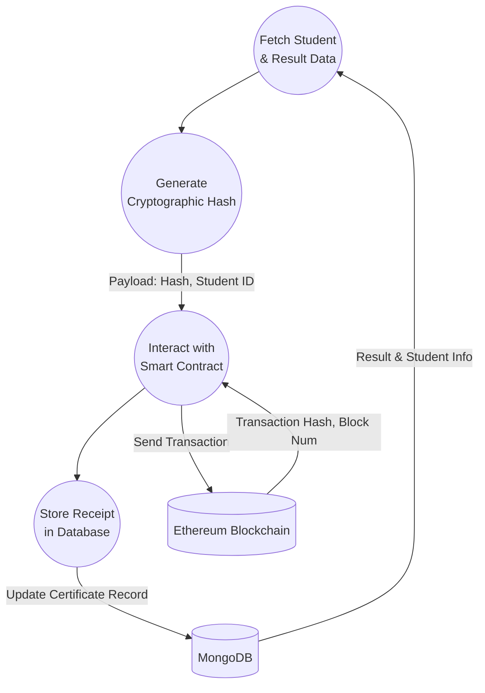

# EDUCATE Portal - Project Documentation

## 1. Problem Statement
Traditional educational certificates are highly susceptible to forgery, tampering, and physical damage. Verifying the authenticity of paper-based or even conventional digital certificates involves tedious, manual processes that are time-consuming and inefficient for employers and institutions. There is a critical need for a decentralized, secure, and instantly verifiable system for academic credentials to ensure trust and transparency.

## 2. Features
- **Admin Dashboard**: Comprehensive management tools for creating courses, managing batches, enrolling students, scheduling exams, processing results, and issuing certificates.
- **Candidate Dashboard**: A personalized portal for students to view enrolled courses, track upcoming exams, check semester results, and access their verified certificates.
- **Blockchain-based Certificate Verification**: Generates a cryptographic hash of certificate details and securely stores it on the Ethereum blockchain. This ensures absolute immutability and verifiable authenticity.
- **Result & Grade Management**: Detailed management of semester-wise marks, subjects, and automated grade calculation.
- **Decentralized Trust**: Secures academic credentials on an immutable ledger, preventing unauthorized modifications.

## 3. Project Proposal with Feasibility Study
**Proposal**: To develop a decentralized education portal leveraging the MERN stack for robust data management and Web3 blockchain technology (Ethereum) to issue, store, and verify immutable academic certificates.

**Feasibility Study**:
- **Technical Feasibility**: High. The MERN stack (MongoDB, Express, React, Node) is a proven architecture for scalable web applications. Ethereum and Hardhat provide an established ecosystem for smart contract development.
- **Operational Feasibility**: High. The user interface is designed to abstract blockchain complexities, making it user-friendly for non-technical administrators and students.
- **Economic Feasibility**: The project utilizes local testnets (Hardhat) during development to ensure zero gas costs. For production, optimized smart contracts will minimize transaction fees (gas), making it a cost-effective solution for institutions.

## 4. System Analysis
The system operates around three primary domains: Administration, Student Portal, and the Blockchain Network.
- **Admin Domain**: Manages the core educational workflows—from course creation to certificate issuance.
- **Candidate Domain**: Allows students to access their educational records and cryptographic certificates.
- **Blockchain Domain**: Acts as the immutable ledger. When a certificate is generated, its unique hash and transaction details are permanently recorded on the blockchain.

## 5. Architecture Used
The system utilizes a hybrid Client-Server and Decentralized Web3 Architecture:
- **Frontend (Client)**: React.js, Vite, and Bootstrap for a responsive, dynamic User Interface.
- **Backend (Server)**: Node.js and Express.js providing RESTful APIs.
- **Database**: MongoDB with Mongoose ODM for structured data storage (Courses, Students, Results, etc.).
- **Blockchain**: Ethereum Network, Solidity Smart Contracts, Hardhat (local Ethereum node), and Ethers.js/Web3.js for seamless backend-to-blockchain communication.

## 6. Project Flow Using SDLC (Software Development Life Cycle)
1. **Requirement Analysis**: Identifying the vulnerability of traditional certificates and defining the need for a blockchain-based verification system.
2. **Design**: Architecting the database schemas (MongoDB), smart contract logic (Solidity), and UI/UX wireframes (React).
3. **Implementation/Coding**: Developing the REST APIs, building frontend components, and writing/deploying smart contracts.
4. **Testing**: Unit testing individual components, smart contract testing on the Hardhat node, and end-to-end integration testing.
5. **Deployment**: Deploying the frontend (e.g., Vercel), backend (e.g., AWS/Render), database (MongoDB Atlas), and smart contracts to an Ethereum testnet/mainnet.
6. **Maintenance**: Monitoring system health, managing database backups, and updating UI components based on user feedback.

## 7. Project Flow with Process
1. **Setup**: Admin creates a new `Course` and initializes a `Batch`.
2. **Onboarding**: Candidates sign up on the portal. Admin approves and assigns them to the active `Batch`.
3. **Examination**: Admin schedules an `Exam` for the specific batch.
4. **Evaluation**: Following the exam, Admin uploads the `Results` (marks, subjects, grades) for the candidates.
5. **Issuance**: Upon successful completion, Admin generates a `Certificate`.
6. **Blockchain Anchoring**: The system calculates a cryptographic hash of the certificate data and initiates a transaction to store it on the Ethereum Blockchain.
7. **Verification**: Any third party (e.g., an employer) can verify the certificate's authenticity in real-time by querying the blockchain using the Certificate ID.

## 8. Entity-Relationship Diagram (ERD)



## 9. Data Flow Diagrams (DFD)

### Level 0 DFD (Context Diagram)


### Level 1 DFD (Main Processes)


### Level 2 DFD (Certificate Generation & Verification Process)


## 10. Testing
- **Unit Testing**: Isolating and testing individual React components (e.g., Dashboard metrics) and backend controllers (e.g., User authentication logic).
- **Smart Contract Testing**: Utilizing Hardhat and Chai to rigorously test the immutability, event emission, and retrieval functions of the Solidity contracts before deployment.
- **Integration Testing**: Ensuring the Node.js backend correctly synchronizes data writes between MongoDB and the Ethereum node without race conditions.
- **Security Testing**: Auditing for common Web3 vulnerabilities (e.g., Reentrancy, Overflow) and traditional web vulnerabilities (e.g., XSS in React, NoSQL injection in MongoDB).

## 11. Deployment
- **Frontend Architecture**: Deployed as a static bundle using services like Vercel, Netlify, or AWS S3 & CloudFront for fast global delivery.
- **Backend Architecture**: Hosted on scalable platforms like AWS EC2, Heroku, or Render to handle API requests and blockchain interactions.
- **Database Layer**: Managed MongoDB Atlas cluster for a highly available, scalable NoSQL database.
- **Blockchain Layer**: Smart contracts are deployed to an Ethereum testnet (e.g., Sepolia) or Mainnet. The backend communicates with the network via RPC providers like Infura or Alchemy.

## 12. Security
- **Data Integrity (Blockchain)**: The primary security feature. Once a certificate's hash is anchored to the Ethereum blockchain, it is mathematically impossible to alter without invalidating the hash, guaranteeing authenticity.
- **Authentication & Authorization**: Role-based access control (Admin vs. Candidate) implemented using secure JWT (JSON Web Tokens) or session management.
- **Data Privacy**: Sensitive personal details (PII) are stored securely in MongoDB. Only the non-reversible cryptographic hash and public identifiers are exposed on the public blockchain, ensuring GDPR compliance.
- **Input Validation**: Strict Mongoose schemas and backend validation middleware enforce data types and constraints to prevent NoSQL injection and malformed data entry.

## 13. Dependencies and Installation Instructions

This section outlines the dependencies for each part of the project and provides step-by-step instructions on how to install them.

### Prerequisites
Before installing the dependencies, ensure you have the following installed on your system:
- [Node.js](https://nodejs.org/) (v16.x or higher recommended)
- [npm](https://www.npmjs.com/) (Node Package Manager)

### Step 1: Backend Dependencies
Navigate to the `backend` directory and install the necessary packages.

```bash
cd backend
npm install
```

**Dependencies:**
- `cors` (^2.8.6): Middleware to enable Cross-Origin Resource Sharing.
- `ethers` (^6.17.0): Library for interacting with the Ethereum Blockchain.
- `express` (^5.2.1): Fast, unopinionated, minimalist web framework for Node.js.
- `mongoose` (^9.9.5): MongoDB object modeling tool designed to work in an asynchronous environment.
- `multer` (^2.3.0): Node.js middleware for handling `multipart/form-data`, primarily used for uploading files.

### Step 2: Frontend Dependencies
Navigate to the `frontend` directory and install the necessary packages.

```bash
cd frontend
npm install
```

**Dependencies:**
- `bootstrap` (^5.3.8): CSS framework for responsive design.
- `ethers` (^6.17.0): Library for interacting with the Ethereum Blockchain.
- `html2canvas` (^1.4.1): Takes "screenshots" of webpages or parts of it to build the certificate visually.
- `jspdf` (^4.2.1): Library to generate PDFs (used for downloading certificates).
- `qrcode.react` (^4.2.0): React component to generate QR codes for certificate verification.
- `react` & `react-dom` (^19.2.8): Core React libraries for building the UI.
- `react-router-dom` (^7.18.3): Declarative routing for React web applications.

**Dev Dependencies:**
- Tools and plugins related to Vite, ESLint, and TypeScript declarations (`@eslint/js`, `@vitejs/plugin-react`, `vite`, etc.) for an optimized development experience.

### Step 3: Ethereum (Blockchain) Dependencies
Navigate to the `ethereum` directory and install the necessary packages.

```bash
cd ethereum
npm install
```

**Dev Dependencies:**
- `@nomicfoundation/hardhat-toolbox` (^6.1.2): Bundles all the commonly used Hardhat plugins.
- `hardhat` (^2.29.0): Ethereum development environment for compiling, testing, and deploying smart contracts locally.

**Dependencies:**
- Various low-level tools and utilities required by the Ethereum ecosystem (`adm-zip`, `ethereum-cryptography`, `micro-eth-signer`, `tsx`, `zod`, etc.).

### Running the Application Locally
After installing all dependencies, you can start the application using the following commands in three separate terminal windows:

1. **Start the local Hardhat Node (Ethereum):**
   ```bash
   cd ethereum
   npx hardhat node
   ```
2. **Start the Backend Server:**
   ```bash
   cd backend
   npm start
   ```
3. **Start the Frontend Application:**
   ```bash
   cd frontend
   npm run dev
   ```
