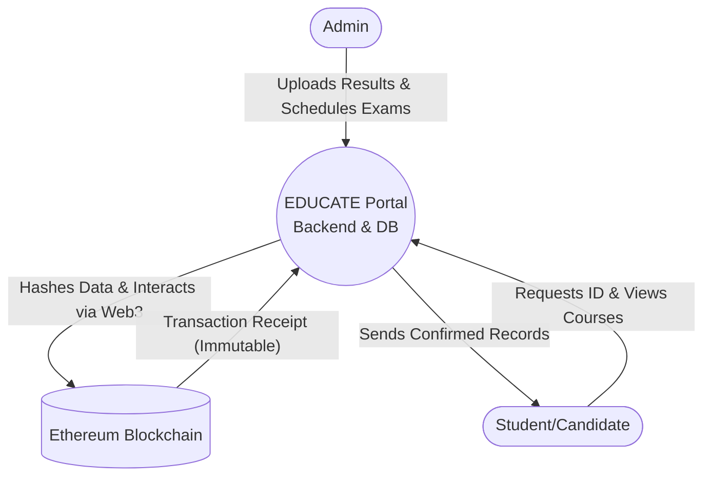

# EDUCATE Portal
### Decentralized Education & Certificate Verification Platform
**Project Documentation & Architecture Analysis**

---

## Introduction

**What is the EDUCATE Portal?**
- A comprehensive platform bridging traditional learning and modern blockchain technology.
- Designed to offer seamless course management for administrators.
- Empowers students by securely minting their academic achievements (certificates, ID cards, and semester results) onto the Web3 ecosystem.

---

## Problem Statement

- **Vulnerability**: Traditional educational certificates and identity cards are highly susceptible to forgery, tampering, and physical damage.
- **Inefficiency**: Verifying the authenticity of paper-based or even conventional digital documents involves tedious, manual processes that are time-consuming for employers and institutions.
- **The Need**: A critical requirement for a decentralized, secure, and instantly verifiable system for academic credentials to ensure absolute trust and transparency.

---

## Core Features

- **Admin & Candidate Dashboards**: Tailored portals for comprehensive management and student access.
- **Dynamic Result Management**: Customized workflows for Certificate (2 subjects) vs Diploma/Degree (Semester-based) courses.
- **Blockchain-based Verification**: Cryptographic hashes of documents are securely stored on Ethereum.
- **Decentralized Trust**: Third-party verification via QR codes and immutable ledger queries, preventing unauthorized modifications.

---

## Project Flow

1. **Course & Batch Setup**: Admins create courses (Certificate or Diploma) and initialize batches.
2. **Candidate Onboarding**: Students sign up, and admins approve and assign them to active batches.
3. **Exam Scheduling & ID Requests**: Admins schedule exams; candidates request blockchain ID cards.
4. **Evaluation & Result Minting**: Admins upload marks. Semester results are anchored to the blockchain.
5. **Final Certificate Issuance**: Upon successful completion of all required semesters, a final consolidated certificate is minted.
6. **Real-time Verification**: Verifiers scan QR codes to confirm document authenticity via smart contracts.

---

## Architecture Used

**Hybrid Client-Server + Decentralized Web3 Architecture**

- **Frontend (Client)**: React.js, Vite, and Bootstrap provide a dynamic and responsive user interface, abstracting blockchain complexities.
- **Backend (Server)**: Node.js and Express.js serve as the robust API layer for data handling and smart contract interaction via Ethers.js.
- **Database Layer**: MongoDB (with Mongoose ODM) manages structured, scalable data like student records and results.
- **Blockchain Layer**: Ethereum network (via Hardhat/Solidity) serves as the immutable ledger for storing transaction receipts and cryptographic hashes.

---

## Project Diagram (Data Flow)

---

## Database, Server, and Blockchain Tools

- **Database**: 
  - *MongoDB* (Atlas/Local NoSQL database)
  - *Mongoose* (Object Data Modeling)
- **Server**: 
  - *Node.js* (JavaScript Runtime)
  - *Express.js* (Fast, minimalist web framework)
- **Blockchain**:
  - *Solidity* (Smart contract programming language)
  - *Hardhat* (Local Ethereum development environment)
  - *MetaMask* (Crypto wallet gateway for admin transaction signing)
  - *Ethers.js* (Library for seamless backend-to-blockchain communication)

---

## Project Repository & Screenshots

**GitHub Repository:**
[https://github.com/saikatssg/student-education-portal.git](https://github.com/saikatssg/student-education-portal.git)

*(Insert screenshots of the platform below or view them directly on the GitHub repository Readme)*

---

### Landing Page (About Us)

---

### Admin Panel: Schedule Exams

---

### Admin Panel: Result Upload (MetaMask Integration)

---

### Admin Panel: Result Anchored Successfully

---

# Thank You!
**The EDUCATE Portal**
*Securing the Future of Academic Credentials on the Blockchain.*
